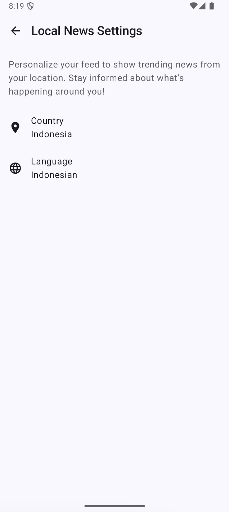

# TrendNow

News aggregator app built using Jetpack Compose with Bonai News API

## Setup

- Get the Bonai News API for free from here https://rapidapi.com/bonaipowered/api/news-api14
- Add the api key to `ApiKey.kt` file inside `app/src/main/java/com/trend/now/` (Need to create the file manually)

```kotlin
package com.trend.now

const val apiKey = "your-api-key"
```

- Run the app (currently using Android Studio Ladybug Feature Drop | 2024.2.2)

## Features

### User features

- Display trending news based on user selected topic
- Local news, display trending news based on user selected county and language.
- TBA

### Technical features

- News cache using `OkHttp` cache and `Room` database
- Automatically detect device location and language to be used for local news preference
- Save user preference on local using `DataStore`
- TBA

## Preview

| |                                               |
|---|-----------------------------------------------|
|  |  |

### Trending news

| Home                                  | Local news                             |
|---------------------------------------|----------------------------------------|
|  |  |

### Local news

| OnBoarding                               | Settings                               |
|------------------------------------------|----------------------------------------|
|  |  |

## Medium articles

Series of medium articles how I built the app

- [Part 1 - TrendNow: Build an Android News App with Jetpack Compose](https://medium.com/@danimahardhika/trendnow-build-an-android-news-app-with-jetpack-compose-618ec1986296)
- [Part 2 - Add News Topics to TrendNow: Implement Horizontal Scroll in LazyColumn Jetpack Compose](https://medium.com/@danimahardhika/add-news-topics-to-trendnow-implement-horizontal-scroll-in-lazycolumn-jetpack-compose-17d27284f4e0)
- [Part 3 - Filter News in TrendNow: Save Data with DataStore and Optimize Recomposition](https://medium.com/@danimahardhika/filter-news-by-topic-in-trendnow-save-user-preferences-with-datastore-and-optimize-recomposition-4e619e8476a8)
- [Part 4 - Load More News in TrendNow: Implement Infinite Scroll in LazyColumn Jetpack Compose](https://medium.com/@danimahardhika/load-more-news-in-trendnow-implement-infinite-scroll-in-lazycolumn-jetpack-compose-6bdc98c25e48)
- [Part 5 - Cache on the Client Side in TrendNow: Implement Room Database](https://medium.com/@danimahardhika/cache-news-topics-in-trendnow-use-room-database-for-efficient-client-side-caching-1b950c10b841)
- [Part 6 - Handle API Limits in TrendNow: Implement OkHttp Cache for Client-Side Caching](https://medium.com/@danimahardhika/handle-api-limits-in-trendnow-implement-okhttp-cache-for-client-side-caching-5989b67ddfbf)
- [Part 7 - Enhance Client-Side Caching in TrendNow: Combine OkHttp Cache and Room Database](https://medium.com/@danimahardhika/enhance-client-side-caching-in-trendnow-combine-okhttp-cache-and-room-database-1f47735924ef)
- [Part 8 - Local News in TrendNow: Handle Multiple Sections in LazyColumn Jetpack Compose](https://medium.com/@danimahardhika/local-news-in-trendnow-handle-multiple-sections-in-lazycolumn-jetpack-compose-1247048f9d81)
- more coming...
